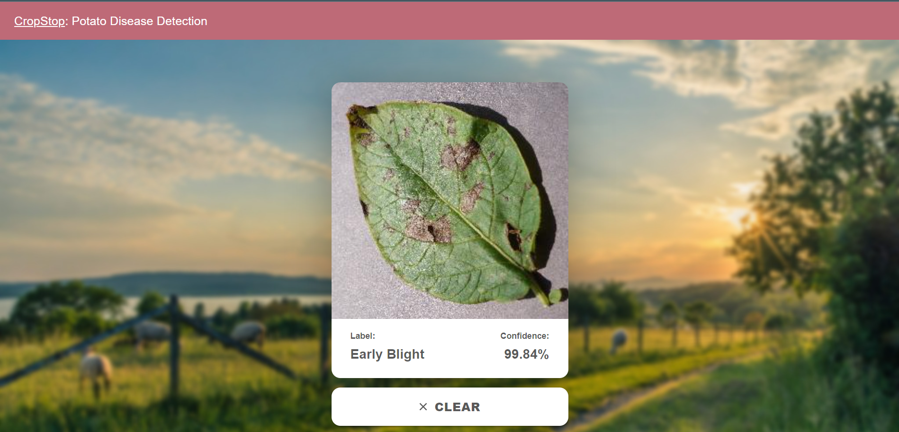
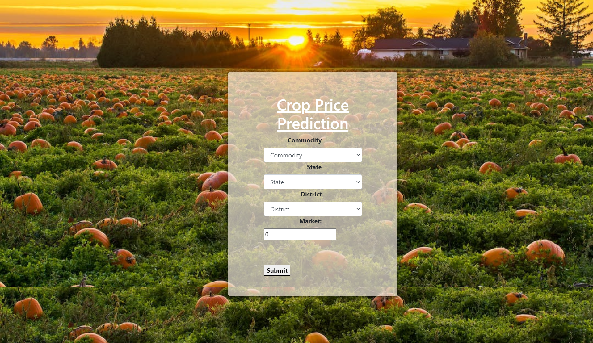
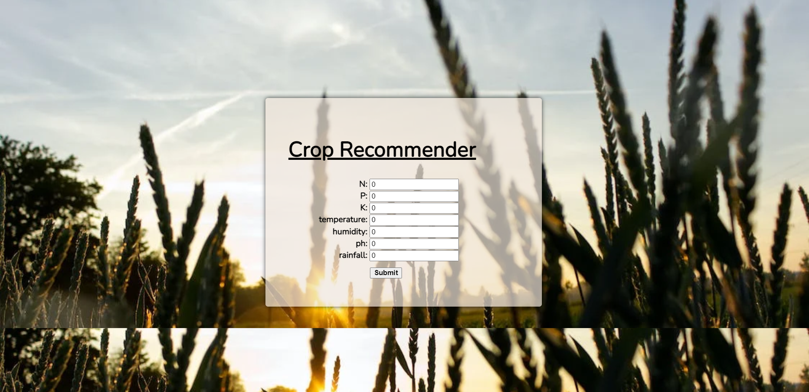
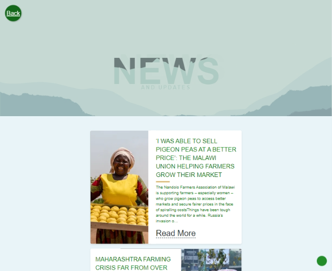

# CropStop

## Team Members:
Pulkit Sinha 

Jayadip Sahoo 

Abhikalp Srivastava 

Ayush Jagatdeb

## Problem Theme: AgroTech

## Problem Statement:
Agriculture is the backbone of the world's economy,
providing food and raw materials for various industries. However,
farmers face numerous challenges in crop cultivation, ranging from price
uncertainty to crop diseases and a lack of information on which crops to
grow. These challenges not only affect farmers' livelihoods but also
impact food security and the global economy.

How can farmers improve their crop yields while reducing their costs and
risks associated with farming, and how can they stay up-to-date with the
latest news and innovations in the agricultural industry?

Farmers across the world face significant challenges in crop
cultivation, including weather patterns, soil quality, access to
resources, and price uncertainty. These challenges have far-reaching
economic and social implications, as agriculture is a major source of
employment and income. Detecting and diagnosing crop diseases is often
difficult, and farmers lack access to information on which crops to grow
and how to optimize their cultivation. Innovative solutions that
leverage technology and data can help to address these challenges, and
platforms like CropStop can empower farmers with real-time market data,
disease detection tools, and crop recommendations based on machine
learning models to build a more resilient and sustainable agriculture
sector.

## Solution Proposed:
Welcome to CropStop, a one-stop solution for all your
agricultural needs. Our platform is designed to provide farmers with the
tools and information they need to succeed in today\'s rapidly changing
agricultural landscape.

## Features:
News and Latest Innovations: Stay up-to-date with the latest
news and innovations in the agricultural industry with CropStop. Our
platform uses the News API to provide users with real-time news and
insights from trusted sources around the world. From new farming
technologies to market trends and policy developments, our news service
covers it all.

## Services :
At CropStop, we offer a comprehensive suite of services
designed to help farmers improve their crop yields and reduce the risks
and costs associated with farming. Our services include:

### \* Price Prediction: 
Predict the prices of crops to help farmers plan and
optimize their production.

### \* Disease Detection: 
Use machine learning models to detect and diagnose crop diseases, enabling farmers to take
proactive steps to manage disease outbreaks and protect their crops.

### \* Crop Recommendation: 
Get personalized crop recommendations based on
machine learning models that take into account local weather patterns,
soil conditions, and other factors that affect crop growth.

## Contact Us:
We are committed to providing the best possible support and
service to our users. If you have any questions or feedback, please
don\'t hesitate to contact us using the contact form on our website. Our
team is always available to help you with any questions or concerns you
may have.

## Technology Used:
### 1\. Frontend: HTML5, CSS3, REACTJS, BOOTSTRAP, JQUERY

### 2\. Backend: FLASK, NODE.JS

### 3\. Machine Learning Models:
### 3.1 Potato Disease Detector:
\* Libraries:
numpy, pandas, matplotlib, tensorflow and keras

\* Methodology: - importing dataset using keras preprocessing  - passing images to
function to resize - dataset partitioning - data augmentation - using
CNN model - creating various CNN layers - using adam compiler - training
the model - accuracy - prediction - save model using pickle dump
### 3.2 Crop Recommender:
\* Libraries: numpy, pandas, matplotlib, scikit-learn

\* Methodology: - import dataset - preprocessing dataset - checking missing
values  - drop unnecessary columns - one hot encoding - creating
dummies - training model - randomForestClassifier - accuracy - confusion
matrix - prediction - save using pickle dump

### 3.3 Crop Price Predictor:
\* Libraries: numpy, pandas, matplotlib, scikit-learn

\* Methodology: - import dataset - preprocessing dataset -
checking missing values  - drop unnecessary columns - one hot encoding -
creating dummies - training model - randomForestClassifier - accuracy -
confusion matrix - prediction

## Working:

### 1\. Landing Page:

### 2\. Services:

#### \* Potato Disease Detector: 
The potato disease detector is
a machine learning model that uses a deep learning algorithm to detect
diseases in potato plants by analyzing images of their leaves. It
identifies symptoms such as discoloration or unusual growth patterns,
and continually updates and refines its accuracy with more images. This
tool helps farmers and researchers take action to prevent further damage
or the spread of disease.

#### \* Crop Price Predictor: 
Crop price predictor is a machine learning
model that helps farmers and traders make informed decisions about
buying and selling crops based on accurate insights about specific
regions and markets.

#### \* Crop Recommender: Get ready to meet your new agricultural advisor -
the crop recommender! Using n, p, k values, temperature, humidity, pH,
and rainfall data, this machine learning model suggests which crops are
most likely to grow and thrive in your area. With its help, you can
optimize yields, increase profits, and promote sustainable agriculture
practices. So, say goodbye to guesswork and hello to bountiful harvests
with the crop recommender!

### 3\. News/ Latest Innovations Page: 
Your go-to destination for all the
latest updates and advancements in the world of agriculture.

It scours news outlets and uses the news API to bring you the most
relevant and up-to-date information on everything from new crop
technologies to emerging trends in sustainable farming practices.

## Scalability:
\* Crop Yield Predictor: The crop yield model will leverage
advanced algorithms to help farmers accurately predict their crop yields
and enable them to make informed decisions regarding their farming
practices. It will be powered by an advanced model that takes into
account a wide range of weather and soil data. By analyzing these data
points, the model can provide highly accurate predictions for a variety
of crops.

\* User Authentication: To ensure that our users\' data is kept safe and
secure, we'll employ industry-standard user authentication protocols to
authenticate and authorize access to our platform. A secure connection
between our webpage and machine learning models to prevent data breaches
and unauthorized access will be maintained. This will ensure that our
users can use the platform with confidence, knowing that their past
activities and data are stored safely and securely.
